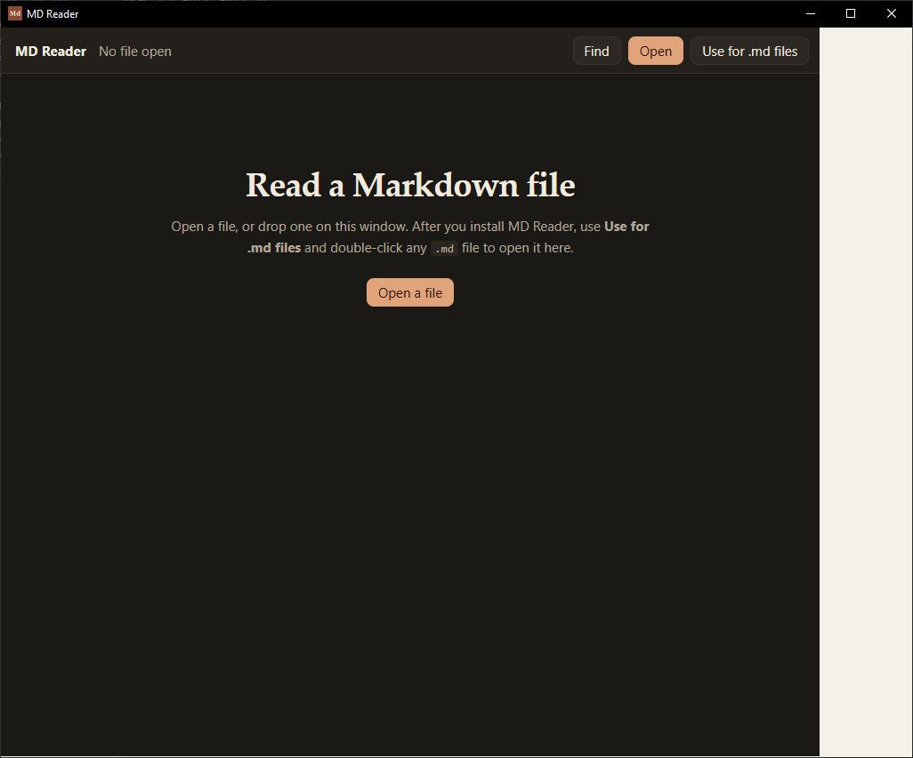
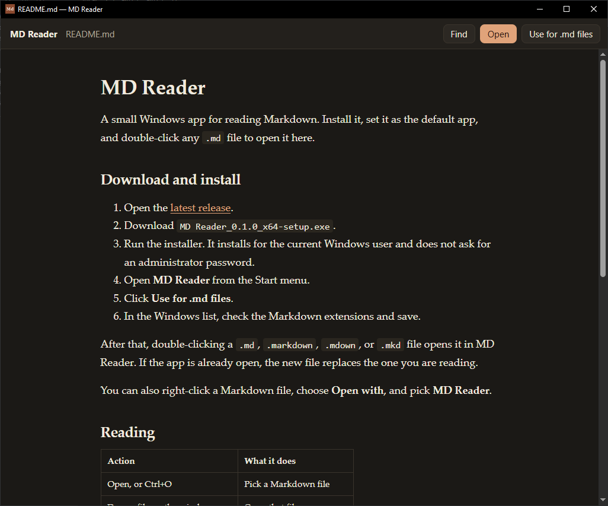

# MD Reader

MD Reader is a free Windows app for reading Markdown files. Install it once, then double-click any `.md` file to open it here.

Project page: https://tpwatson.github.io/md-reader/





## Install MD Reader

1. Open the [MD Reader download page](https://github.com/tpwatson/md-reader/releases/latest).
2. Scroll down to **Assets**.
3. Click **MD.Reader_0.1.0_x64-setup.exe**. Leave the **Source code** links alone. Those are for people who write software.
4. The file downloads to your **Downloads** folder. If the browser asks whether to keep it, choose **Keep**.
5. Open **Downloads** and double-click **MD.Reader_0.1.0_x64-setup.exe**.
6. If Windows says it protected your PC, click **More info**, then **Run anyway**.
7. Follow the installer until it finishes. It installs for your Windows account only, so it does not ask for an administrator password.
8. Open the Start menu, type **MD Reader**, and click the app.

## Make MD Reader open .md files

1. In the MD Reader window, click **Use for .md files**.
2. Windows opens a list of file types. A short note in MD Reader says that list is open.
3. Check **.md**. Also check **.markdown**, **.mdown**, and **.mkd** if those appear.
4. Click **Save**.

Find a Markdown file and double-click it. It opens in MD Reader. If MD Reader is already open, the new file replaces the one on screen.

If the file still opens in another program, right-click it and choose **Open with**, then **Choose another app**. Select **MD Reader**. On Windows 11, click **Always**. On Windows 10, check **Always use this app to open .md files**, then click **OK**.

## Reading

| Action | What it does |
| --- | --- |
| Open, or Ctrl+O | Pick a Markdown file |
| Drop a file on the window | Open that file |
| Ctrl+F | Find text in the document |
| Click a link to another `.md` file | Open it in MD Reader |
| Click a web link | Open it in your browser |

Pictures stored next to the Markdown file show up in the page. When you save the file from another program, MD Reader refreshes.

## Building the app yourself

Skip this section if you already installed MD Reader from the download above.

You need Rust, Node.js, and the Microsoft C++ build tools. WebView2 is already on Windows 10 and 11.

```
npm install
npm run tauri dev
```

The development build can open files. Windows will not use it as the default app. To build the installer:

```
npm run tauri build
```

The installer is written to `src-tauri/target/release/bundle/nsis/`.

MD Reader is free under the MIT license.
